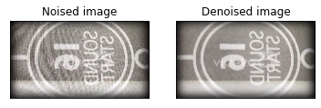

# Video and Image-Noise-Reduction

Performing Video and Image Noise Reduction using OpenCV.

In this project, we are denoising the Video clip or Image using OpenCV.

The Noised image and Denoised image after applying the reduction are:

 
 
 Denoising of an image refers to the process of reconstruction of a signal from noisy images. Denoising is done to remove unwanted noise   from image to analyze it in better form. 

The final PSNR values(Peak signal-to-noise ratio) to frames output are:

  

